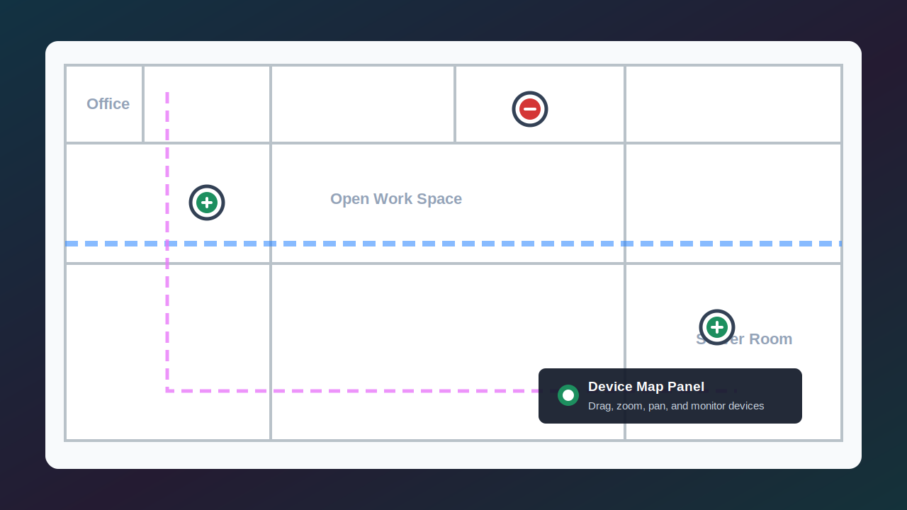

# Home Assistant Device Panel



A Lovelace custom card for a clear Home Assistant dashboard view of offline devices.

The card:

- Shows one card per Home Assistant device, grouped by area.
- Uses a red frame for devices with unavailable or unknown entities.
- Shows an alarm banner when offline devices are detected, grouped by affected area.
- Uses a green frame for online devices when the online filter is enabled.
- Filters by status, multiple domains, multiple integrations, multiple areas, and search text.
- Switches between detailed cards and simple cards from the dashboard.
- Opens the normal Home Assistant more-info dialog when a device card is clicked.

## Install with HACS

1. In HACS, open the three-dot menu and select **Custom repositories**.
2. Add `https://github.com/Hollako/Home-Assistant-Device-Panel`.
3. Select **Dashboard** as the category.
4. Download **Home Assistant Device Panel**.
5. In Home Assistant, go to **Settings > Dashboards > Resources**.
6. Add this resource:

```yaml
url: /hacsfiles/Home-Assistant-Device-Panel/Home-Assistant-Device-Panel.js
type: module
```

The HACS release uses a single JavaScript file, so updates only need to refresh `Home-Assistant-Device-Panel.js`.

7. Add a manual Lovelace card:

```yaml
type: custom:offline-device-panel
title: Offline Devices
show_online: true
display_mode: detailed
offline_states:
  - unavailable
  - unknown
```

## Manual Install

1. Copy `Home-Assistant-Device-Panel.js` to your Home Assistant `config/www/` folder.
2. In Home Assistant, go to **Settings > Dashboards > Resources**.
3. Add the resources you want to use:

```yaml
url: /local/Home-Assistant-Device-Panel.js
type: module
```

4. Add a manual Lovelace card:

```yaml
type: custom:offline-device-panel
title: Offline Devices
show_online: true
display_mode: detailed
offline_states:
  - unavailable
  - unknown
```

## Device Map Panel

Use `custom:device-map-panel` when you want to place devices on a drawing or floor plan.

```yaml
type: custom:device-map-panel
title: Device Map
image: /local/floorplan.png
offline_states:
  - unavailable
  - unknown
```

For multiple floorplans, use `floors` instead of the single `image` option:

```yaml
type: custom:device-map-panel
title: Device Map
floors:
  - id: ground
    name: Ground Floor
    image: /local/floorplans/ground-floor.png
    markers: []
  - id: first
    name: First Floor
    image: /local/floorplans/first-floor.png
    markers: []
```

When `floors` is configured, the top bar shows a floor selector. Each floor has its own image and marker positions, while the same sidebar, filters, Edit Mode tools, alignment tools, and YAML export continue to work on the selected floor.

The card shows a sidebar with all devices. Filter the list, then drag devices from the sidebar onto the drawing. Drag an existing marker to move it, or use **Remove** in the sidebar to remove it from the map.

The map opens in **User Mode** by default, which shows only the drawing and device markers. Home Assistant admin users can switch to **Edit Mode** to see the sidebar, filters, drag-and-drop tools, remove buttons, and YAML export. Non-admin Home Assistant users cannot enter Edit Mode.

In Edit Mode, use **Hide Sidebar** in the top bar to collapse the sidebar and give the floorplan more space. Use **Show Sidebar** to bring it back.

In Edit Mode, click a marker to select it, or Ctrl-click/Cmd-click multiple markers to build a selection. Use the alignment buttons to align the selected markers left, right, top, or bottom. Use **Space H** or **Space V** to distribute three or more selected markers evenly between the outer markers. Hold Ctrl/Cmd while dragging one selected marker to move the selected group together.

Hold Shift and drag on empty map space to draw a selection box around multiple markers. Hold Ctrl/Cmd with Shift-drag to add markers to the current selection.

Press Delete or Backspace in Edit Mode to remove the selected markers.

Use **Scatter visible unplaced** in Edit Mode to automatically place the currently filtered unplaced devices across the floor plan before manually rearranging them.

Use the map zoom controls to zoom from 50% to 400%. The drawing and markers scale together, and marker positions stay aligned while zoomed.

Markers automatically choose icons from the device/entity type when possible, such as bulbs for lights and motion icons for motion sensors. In Edit Mode, placed devices also show an icon picker in the sidebar so admins can override the marker icon.

Use the display controls on the map to make markers smaller or larger and to show or hide marker names. When marker names are hidden, hovering over a marker still shows the device name. When zoomed in, drag the map background to pan around the floor plan.

By default, marker color shows availability only: green for online and red for offline. To also show entity state, enable `show_entity_state`. In that mode, the marker glow/ring still shows availability, while the inside color shows state: yellow for active/on/detected, black for inactive/off/clear, and full red when offline.

```yaml
type: custom:device-map-panel
title: Device Map
image: /local/floorplan.png
show_entity_state: true
```

When placed markers are offline, the map shows an offline marker notification list above the floorplan. Click an offline marker in that list to switch to the correct floor, center the map on the marker, and briefly highlight it.

Marker positions are saved in the browser automatically. Open **Export YAML** to copy the current marker layout into your dashboard configuration:

```yaml
type: custom:device-map-panel
title: Device Map
image: /local/floorplan.png
markers:
  - key: example_device_id
    entity: light.kitchen
    name: Kitchen Light
    icon: mdi:lightbulb
    x: 42.50
    y: 58.00
```

With multiple floors, **Export YAML** returns all floor layouts together:

```yaml
floors:
  - id: ground
    name: Ground Floor
    image: /local/floorplans/ground-floor.png
    markers:
      - key: example_device_id
        entity: light.kitchen
        name: Kitchen Light
        icon: mdi:lightbulb
        x: 42.50
        y: 58.00
```

If you use multiple map cards with the same title on the same dashboard, set a unique `storage_key` for each one:

```yaml
type: custom:device-map-panel
title: First Floor
image: /local/first-floor.png
storage_key: first-floor-map
```

To always load marker positions from YAML only, disable browser layout persistence:

```yaml
type: custom:device-map-panel
title: Device Map
image: /local/floorplan.png
persist_layout: false
```

## Example Dashboard View

```yaml
title: Device Health
path: device-health
icon: mdi:alert-circle-outline
cards:
  - type: custom:offline-device-panel
    title: Device Health
    show_online: true
    display_mode: detailed
    offline_states:
      - unavailable
      - unknown
```

## Optional Pre-Filters

Use these when you want a dashboard view that starts from a smaller scope.

```yaml
type: custom:offline-device-panel
title: Lighting Health
domains:
  - light
  - switch
integrations:
  - zha
  - mqtt
areas:
  - Living Room
  - Kitchen
offline_states:
  - unavailable
  - unknown
```

## Persistent Filters

Dashboard filter selections are saved in the browser and restored after page refreshes.

If you use multiple copies of the card with the same title on the same dashboard, set a unique `storage_key` for each one:

```yaml
type: custom:offline-device-panel
title: Lighting Health
storage_key: lighting-health
```

To always reset filters when the page loads, disable persistence:

```yaml
type: custom:offline-device-panel
title: Offline Devices
persist_filters: false
```

## Simple Cards

Use `display_mode: simple` when you want compact cards with less detail.

```yaml
type: custom:offline-device-panel
title: Simple Device Health
display_mode: simple
show_online: true
offline_states:
  - unavailable
  - unknown
```

Use `force_simple: true` when you want the card to always stay in simple mode and hide the **Card style** filter from the dashboard:

```yaml
type: custom:offline-device-panel
title: Simple Device Health
force_simple: true
show_online: true
```

## Friendly Labels

Use `domain_labels` and `integration_labels` to rename technical Home Assistant names in the card and filter dropdowns.

```yaml
type: custom:offline-device-panel
title: Device Health
domain_labels:
  binary_sensor: Motion Sensors
  light: Lighting
  switch: Switches
integration_labels:
  zha: Zigbee
  mqtt: MQTT Devices
  esphome: ESPHome
```

## Notes

- `domains` use entity domains such as `light`, `cover`, `sensor`, `switch`, `climate`, and `binary_sensor`.
- `integrations` use Home Assistant platform names from the entity registry, such as `zha`, `mqtt`, `shelly`, `hue`, or `esphome`.
- `domain_labels` and `integration_labels` only change display text. Filters still use the original Home Assistant domain/integration values.
- `areas` can be area names or area IDs.
- The dashboard filters for domains, integrations, and areas support multiple checked values.
- If an entity is not attached to a device in the registry, the card still shows it as its own fallback item.
